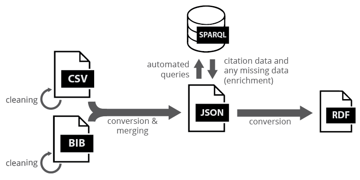

# KFIR
Repository of the [Knowledge Flows in Interdisciplinary Research](http://www.networkinstitute.org/academy-assistants/academy-projects-17/#) project of VU Network Institute.

Is also the main repository for the packages 'triplicator' and 'preprocessor'. For descriptions of these individual modules, please see their directory. 
 
## Functionality 

## Requirements:
- Pyhon 3.x
- pybtex
- sparqlwrapper

## Quickstart
Convert .bib to .ttl:

    my_bibtex_file = Bibtex_File('demo.bib')
    my_bibtex_file.convert_to_ttl(desired_version_suffix='v0.1', 
                                  desired_source_bibliography_name='my-bib',
                                  output_directory='output')

Retrieve articles by DOIs from Open Citations:

    doi_list = ['10.1163/187607508X384689', '10.1017/S0954579416000572']
    oc_query = Open_Citations_Query()
    oc_query.retrieve_articles_by_dois(doi_list, show_progress_bar=True)
    oc_query.write_results_to_csv('retrieved_articles.csv')

See the ***examples*** directory for more examples.
Further documentation provided in docstrings within the code.

## Legal
Although short samples may be provided, bibliographic databases from VU and UvA are not included in this directory due to copyright reasons related to their respective owners. Data gathered from OpenCitations, however, are made fully available.

## Change Log
The numbers in parentheses before the log entries denote story points.

### v0.6: Web of science implementation and bug fixes 🔥 27/03/18 > 05/04/18

#### ⭐ New (2)
- [(24) Pure dataset enriched using Web of Science database](https://trello.com/c/k0H98Dsz/39-24-pure-dataset-enriched-using-web-of-science-database-16)
- [(6) OpenCitations ID and Pure ID added to entry fields on LD-R](https://trello.com/c/wiALKmqp/33-6-opencitations-id-and-pure-id-added-to-entry-fields-on-ld-r-2)

#### 👍 Enhancement (2)
- [(18) Instance NAMES are now identifiers (i.e., Pure IDs and OpenCitations IDs) instead of URI-safe versions of article titles, so that it is now ensured that instance names are always unique (e.g., no more duplicate entries because of a title such as 'Intro'), and it is easier to refer to entries in a citation network. Instance LABELS stayed as article titles](https://trello.com/c/Mnx51k5X/31-18-instance-names-are-now-identifiers-ie-pure-ids-and-opencitations-ids-instead-of-uri-safe-versions-of-article-titles-so-that-i)
- [(7) Very long test outputs (e.g., due to progress bars in logs) removed in order to make it easier to navigate source code](https://trello.com/c/Vg6XeuJZ/10-7-very-long-test-outputs-eg-due-to-progress-bars-in-logs-removed-in-order-to-make-it-easier-to-navigate-source-code)

#### 🐛 Fixed (2)
- [(6) Strange document types no longer appear in LD-R](https://trello.com/c/NwtnAwYG/29-6-strange-document-types-no-longer-appear-in-ld-r-1)
- [(5) Field names in CSV and BIB parsing operations standardized: Now parsing operations of both bib and csv files result in the same field names](https://trello.com/c/3sWBIuHX/36-5-field-names-in-csv-and-bib-parsing-operations-standardized-now-parsing-operations-of-both-bib-and-csv-files-result-in-the-same)

### v0.5: OpenCitations enrichment and data merge ✅ 06/03/18 > 27/03/18

#### ⭐ New (5)
- [(8) Merge functionality fully implemented and tested](https://trello.com/c/NNy94TYB/30-8-merge-functionality-fully-implemented-and-tested)
- [(5) Implemented method to retrieve all entries with matching DOIs from OpenCitations](https://trello.com/c/h36euAFO/21-5-implemented-method-to-retrieve-all-entries-with-matching-dois-from-opencitations)
- [(5) All DOIs in bib files stored in a file](https://trello.com/c/Pl5QUor5/20-5-all-dois-in-bib-files-stored-in-a-file)
- [(21) Enrich method for OpenCitations and Pure implemented](https://trello.com/c/5darswd8/7-21-enrich-method-for-opencitations-and-pure-implemented)
- (8) Implemented methods for one-statement conversion of bib and csv files to ttl  
- (12) Added real-time reporting (e.g., with progress bars in console) and logging for all methods that take a long time to complete 

#### 👍 Enhancement (5)
- [(8) verbose_input parameter and the functionality removed form bib and csv parsing operations, so that it does not majorly slow down the processes if someone activates it by mistake](https://trello.com/c/AyD0pV06/27-8-verboseinput-parameter-and-the-functionality-removed-form-bib-and-csv-parsing-operations-so-that-it-does-not-majorly-slow-down)
- [(12) CSV file cleaning script improved (using already-existing cleaning scripts) so that it can be imported into .ttl without issues](https://trello.com/c/2cAvX18e/28-12-csv-file-cleaning-script-improved-using-already-existing-cleaning-scripts-so-that-it-can-be-imported-into-ttl-without-issues)
- [(8) Flexible search (instead of exact match search) is implemented in SPARQL query functionality](https://trello.com/c/a3zzmaQC/23-8-flexible-search-instead-of-exact-match-search-is-implemented-in-sparql-query-functionality)
- [(5) Example scripts folder updated and revised](https://trello.com/c/l31402yK/26-5-example-scripts-folder-updated-and-revised)
- (8) All functions in the project converted to their object-oriented equivalents

#### 🐛 Fixed (2)
- [(18) Fixed: Some author fields appearing empty](https://trello.com/c/7fZvyiV8/4-18-fixed-some-author-fields-appearing-empty)
- [(5) Publication type in ttl files made uniform across datasets (e.g., Journal Article and JournalArticle --> Article)](https://trello.com/c/eOO0h9dS/2-5-publication-type-in-ttl-files-made-uniform-across-datasets-eg-journal-article-and-journalarticle-article)

